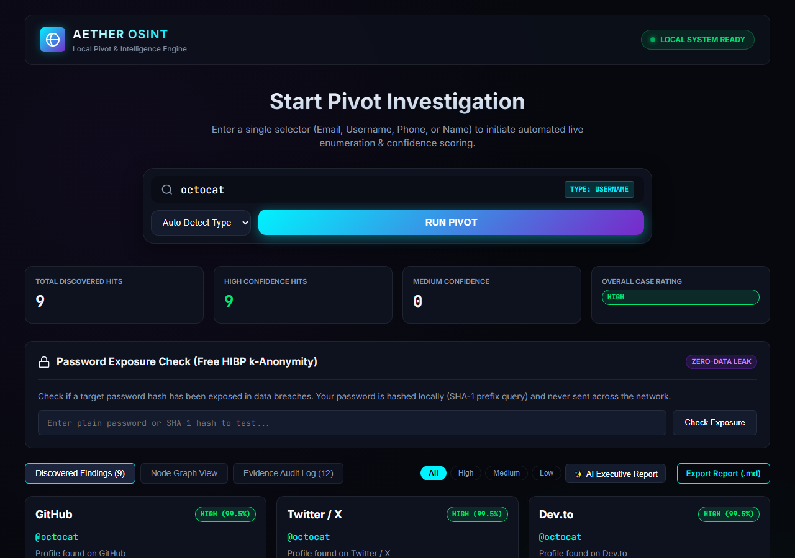

# OSINT Investigation Platform

Local-first OSINT investigation platform for selector-based enumeration, evidence logging, and report generation.

## What it does

- Starts investigations from an email, username, phone number, or domain
- Runs local/free enumeration adapters
- Stores hits and append-only evidence in SQLite
- Serves a browser UI from the backend
- Supports local password exposure checks through HIBP k-anonymity
- Generates simple markdown reports and case summaries

## Project Layout

- `run.py` - launcher for the backend server
- `backend/` - main FastAPI application and supporting services
- `app/static/` - browser UI assets served at `http://127.0.0.1:8000`
- `frontend/streamlit_app.py` - optional Streamlit front end
- `tests/` - unit and integration coverage
- `config.yaml` - app, guardrail, AI, and retention settings

## Requirements

Install the Python dependencies first:

```powershell
pip install -r requirements.txt
```

## Run the app

Start the backend and UI:

```powershell
python run.py
```

Then open:

```text
http://127.0.0.1:8000
```

## Screenshot

Captured UI screenshot of the tool:



Additional screenshots are available in [`data/evidence/screenshots/`](data/evidence/screenshots/).

## Testing

Run the test suite:

```powershell
python -m unittest discover -s tests -q
```

## Notes

- The app is designed to stay local-first.
- Cloud API keys are blocked by guardrails at startup.
- Evidence logging is append-only.
